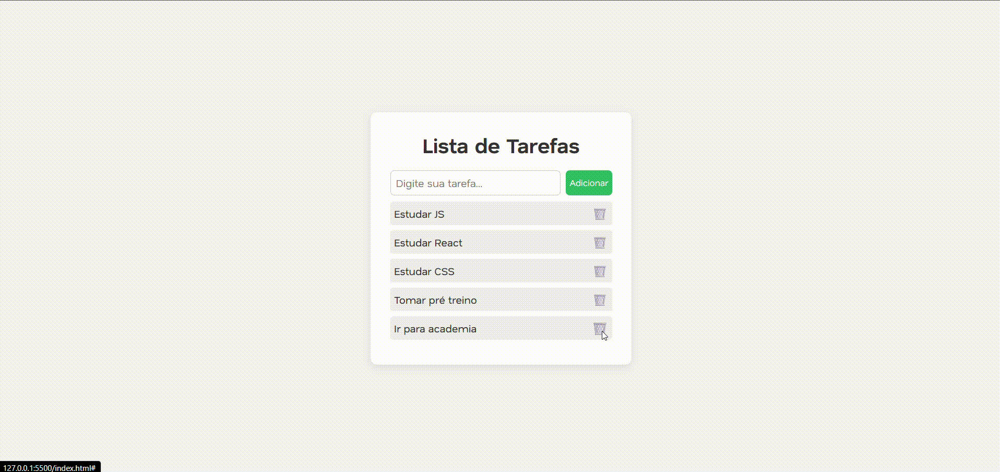

# To-do List (JavaScript Puro)

Projeto simples de **lista de tarefas** desenvolvido em **JavaScript puro**, com persistência de dados no `localStorage`.

---

## Tecnologias

- HTML5
- CSS3
- JavaScript (ES6+)

---

## Funcionalidades

- Adicionar tarefas
- Excluir tarefas
- Salvar no `localStorage`
- Adicionar tarefa ao pressionar **Enter**

---

## Demonstração

👉 Veja o projeto rodando: [To-do List Live](https://SEU-USUARIO.github.io/to-do-list/)

### Preview da aplicação

---

## Aprendizados

- Manipulação do DOM
- Uso de eventos (`click`, `keypress`)
- Armazenamento de dados no navegador (`localStorage`)
- Boas práticas em funções e organização de código

---

## Autor

**Jonathan Tallis Pereira de Fonte**  
🔗 [LinkedIn](https://www.linkedin.com/in/jonathantallis) | [GitHub](https://github.com/JonathanTallis)
